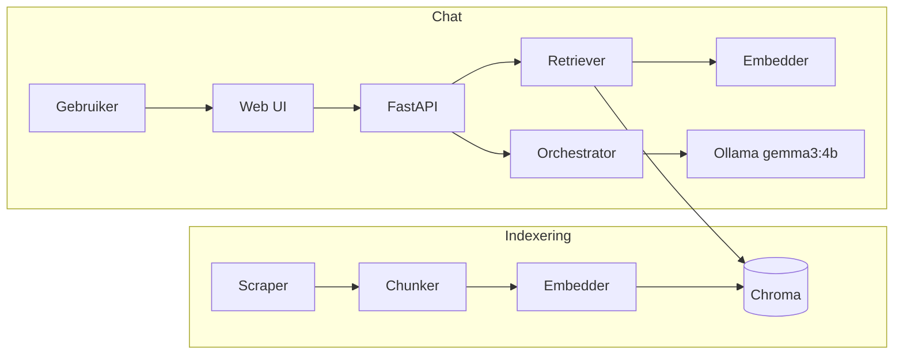
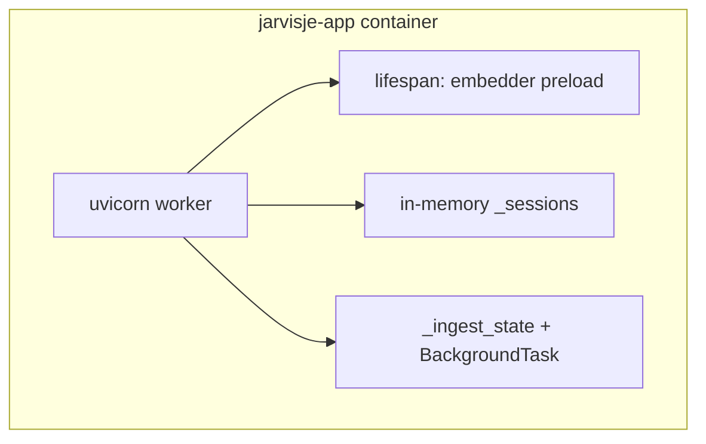
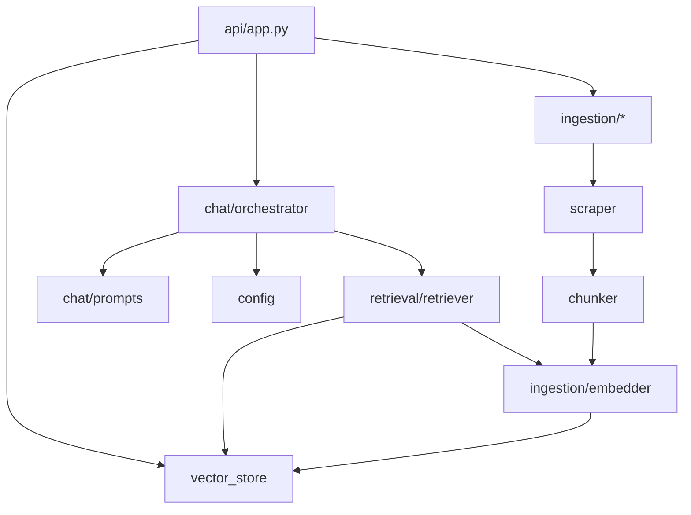
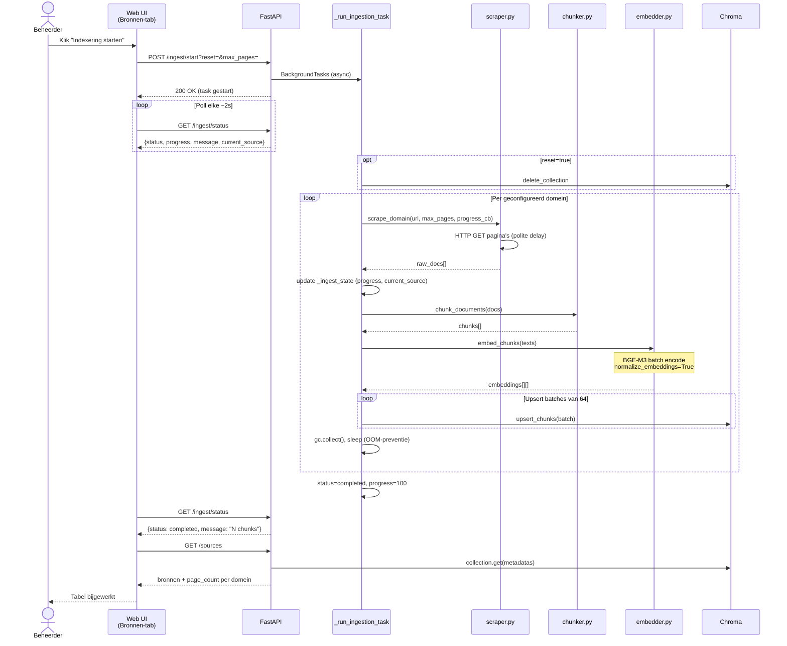
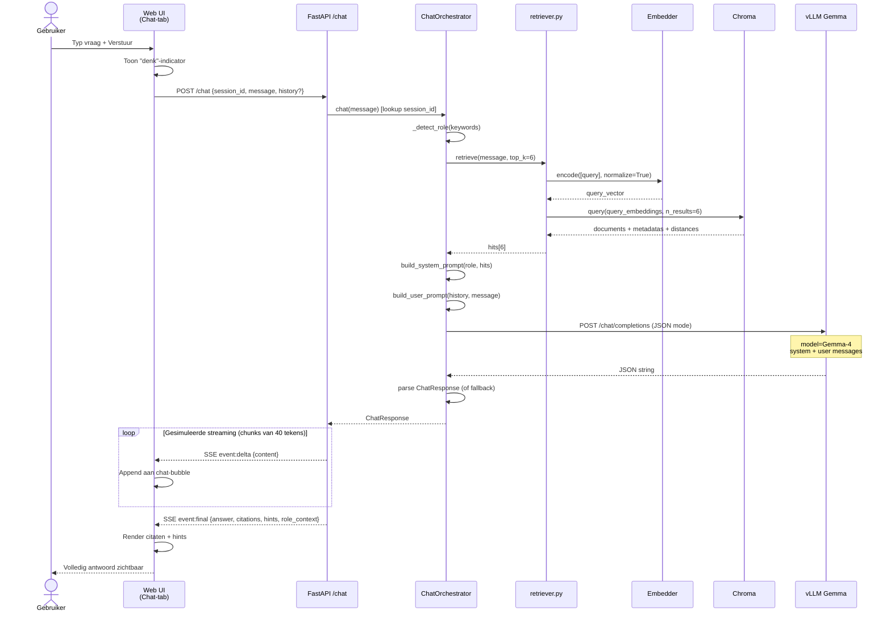
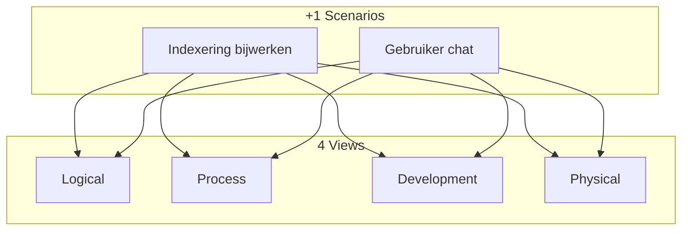

# Technisch design — Sogyo Kennis-Chatbot (Jarvisje)

| Veld | Waarde |
|------|--------|
| **Versie** | 0.4 (MVP) |
| **Status** | Productie op 192.168.165.15 — Ollama gemma3:4b + Cloudflare jarvisje.com |
| **Datum** | 2026-08-08 |
| **Gerelateerde docs** | [Platform-overzicht](platform-overzicht.html), `infra/runbooks/` |

---

## Doel en scope

Dit document beschrijft de **applicatie-architectuur** van de Sogyo Kennis-Chatbot: hoe content wordt geïndexeerd in een vector database, hoe embeddings worden berekend, en hoe de web-app een RAG-gesprek voert met de gebruiker.

Het document volgt het **4+1 architectuurmodel** van Philippe Kruchten. Dat model splitst architectuur in vier complementaire views plus een scenarioview die alles samenbindt:

| View | Kernvraag |
|------|-----------|
| **Logical** | Welke functionele onderdelen en data bestaan er? |
| **Process** | Wat draait er tegelijk, synchroon of asynchroon? |
| **Development** | Hoe is de codebase gestructureerd? |
| **Physical** | Op welke machines en opslag draait het? |
| **Scenarios (+1)** | Hoe zien concrete use cases er stap voor stap uit? |

**In scope:** indexering, Chroma, embedding-model, retrieval, chat-orchestratie, FastAPI, web-UI.  
**Buiten scope:** deploy-runbooks (zie platform-overzicht), designer-agent tooling, toekomstige Qdrant-migratie (alleen genoemd als evolutiepad).

### Begrippenlijst

| Term | Betekenis |
|------|-----------|
| **RAG** | Retrieval-Augmented Generation: eerst relevante bronnen ophalen, dan LLM-antwoord genereren |
| **Chunk** | Tekstfragment (~800 tekens) uit een webpagina, met metadata |
| **Embedding** | Float-vector die de semantische betekenis van tekst vastlegt |
| **Collection** | Chroma-logische index; één per embedding-model |
| **Upsert** | Insert of update: bestaande chunk-id wordt overschreven |
| **SSE** | Server-Sent Events: streaming HTTP voor chat-antwoorden |
| **top_k** | Aantal meest vergelijkbare chunks bij retrieval (default: 6) |

---

## Executive summary

De Sogyo Kennis-Chatbot is een **RAG-systeem** dat publieke content van Sogyo en zes partnerdomeinen indexeert en daarover in natuurlijke taal vragen beantwoordt. De kern bestaat uit vijf ketens:

1. **Indexering:** scrape → chunk → embed → Chroma  
2. **Retrieval:** embed gebruikersvraag → similarity search in Chroma  
3. **Generatie:** LLM (Ollama `gemma3:4b`, OpenAI-compatible) + gestructureerd JSON-antwoord  
4. **API:** FastAPI levert chat, ingest en metadata-endpoints  
5. **Web-UI:** één HTML-pagina met tabs voor chat, bronnenbeheer en architectuur-uitleg  

**Twee hoofd-use cases** (uitgewerkt in [Scenarios](#6-scenarios-1-view)):

- **Indexering bijwerken** — beheerder start via UI of CLI een herindexering  
- **Gebruiker chat** — bezoeker stelt een vraag en ontvangt antwoord met citaten  



---

## 1. Logical View

De logical view beschrijft **wat** het systeem doet, los van deployment en bestandsstructuur.

### 1.1 Subsystemen

| Subsysteem | Verantwoordelijkheid | Kernmodules |
|------------|---------------------|-------------|
| **Ingestion** | Webcontent ophalen en indexeren | `scraper`, `chunker`, `embedder`, `vector_store` |
| **Retrieval** | Semantisch zoeken in de kennisbank | `retriever` |
| **Chat** | RAG-pipeline + LLM-aanroep + structured output | `orchestrator`, `prompts`, `models` |
| **API** | HTTP-endpoints, SSE, background ingest | `api/app.py` |
| **Web UI** | Gebruikersinterface (chat, bronnen, uitleg) | `web/index.html` |

### 1.2 Datamodel

#### Raw document (na scrape)

| Veld | Type | Beschrijving |
|------|------|--------------|
| `url` | string | Volledige pagina-URL |
| `title` | string | Paginatitel (HTML `<title>` of fallback) |
| `source` | string | Domeinnaam (bijv. `sogyo.nl`) |
| `text` | string | Geëxtraheerde platte tekst |
| `ingested_at` | ISO datetime | Tijdstip van verwerking |

#### Chunk (na chunking)

| Veld | Type | Beschrijving |
|------|------|--------------|
| `url` | string | Bron-URL |
| `chunk_id` | int | Volgnummer binnen de pagina (0, 1, 2, …) |
| `text` | string | Chunk-inhoud (~800 tekens) |
| `title`, `source`, `ingested_at` | | Overgenomen van parent document |

**Chroma-document-id:** `{url}::chunk-{chunk_id}` — deterministisch, geschikt voor upsert bij herindexering.

#### Embedding

- Model: **`BAAI/bge-m3`** (multilingual, geschikt voor Nederlands)
- Dimensie: ~1024 (model-afhankelijk)
- Normalisatie: `normalize_embeddings=True` bij encode en query
- Afstand in Chroma: **cosine** (`hnsw:space: cosine`)

#### Collection

- Naam: `sogyo_knowledge_{model_safe}` — afgeleid van `settings.embedding_model`
- Reden voor model-prefix: voorkomt dimensie-mismatch bij wisselen van embedding-model
- Metadata op collection-niveau: `{"hnsw:space": "cosine"}`

#### Chat-sessie (logisch)

| Veld | Beschrijving |
|------|--------------|
| `session_id` | Door client gegenereerd; koppelt aan één `ChatOrchestrator` |
| `turns` | Lijst van user/assistant-berichten |
| `role` | `sollicitant`, `bedrijf` of `onbekend` (keyword-detectie) |

### 1.3 Embedding-model

Het embedding-model zet tekst om in vectoren voor similarity search.

**Implementatie** (`ingestion/embedder.py`):

- **Lokaal (default):** `sentence-transformers` met `BAAI/bge-m3`
- **Device:** `cuda` als beschikbaar, anders `cpu`; overschrijfbaar via `EMBEDDING_DEVICE`
- **Remote (optioneel):** bij `EMBEDDING_API_BASE` worden embeddings uitbesteed naar een OpenAI-compatible `/v1/embeddings` endpoint (bijv. vLLM op DGX)
- **Batching:** GPU-batch tot 128; CPU via `embedding_batch_size` (default 32)
- **Singleton:** `get_embedder()` laadt het model één keer en hergebruikt de instantie

**Preload bij startup:** FastAPI `lifespan` roept `get_embedder()` aan tenzij `embedding_api_base` is gezet. Zonder preload duurt de eerste chat 30–90 seconden (download + laden).

**Productie-notitie (.15 / RTX 5060 Ti):** PyTorch 2.6+cu124 ondersteunt sm_120 (Blackwell) nog niet; embeddings op **CPU** (`EMBEDDING_DEVICE=cpu`). LLM via Ollama op GPU.

### 1.4 Vector database (Chroma)

Chroma is de **persistente vector store** voor MVP.

| Aspect | Keuze |
|--------|-------|
| Client | `chromadb.PersistentClient` |
| Pad | `data/chroma/` (in container: volume `/app/data`) |
| Schrijven | `collection.upsert(ids, documents, embeddings, metadatas)` |
| Lezen | `collection.query(query_embeddings, n_results, include=[...])` |
| Reset | `client.delete_collection(name)` + cache invalidatie |

**Opgeslagen metadata per chunk:**

```json
{
  "url": "https://sogyo.nl/traineeship",
  "title": "Traineeship bij Sogyo",
  "source": "sogyo.nl",
  "chunk_id": 0,
  "ingested_at": "2026-07-01T12:00:00"
}
```

**Evolutiepad:** in code staat een migratiepad naar Qdrant gedocumenteerd; MVP blijft bij Chroma vanwege eenvoud en embedded persistent storage.

### 1.5 Chunking-strategie

MVP gebruikt **character-based chunking** met overlap (`ingestion/chunker.py`):

| Parameter | Default | Betekenis |
|-----------|---------|-----------|
| `chunk_size` | 800 | Tekens per chunk |
| `chunk_overlap` | 150 | Overlap tussen opeenvolgende chunks |

Korte pagina's worden als één chunk opgeslagen. Toekomstige verbetering: heading-aware of token-aware chunking.

### 1.6 Bronnen (sources)

Geconfigureerd in `config.py`:

- sogyo.nl  
- jeroenteunisse.nl  
- edwinvandillen.nl  
- augmentedorganisation.nl  
- intentdriven.nl  
- augmentedengineering.nl  

`max_pages_per_domain` (default 50) beperkt crawl-diepte per domein.

### 1.7 Chat-logica (RAG + LLM)

De `ChatOrchestrator` voert per bericht uit:

1. **Roldetectie** — keywords (`sollicitant`, `bedrijf`, …)  
2. **Retrieval** — `retrieve(message, top_k=6)`  
3. **Promptbouw** — system prompt met bronfragmenten + user prompt met history  
4. **LLM-call** — OpenAI-compatible `POST /v1/chat/completions` met `response_format: json_object`  
5. **Parsing** — `ChatResponse` (Pydantic); fallback bij ongeldige JSON  
6. **Sessie-update** — turns bijwerken in memory  

**Structured output** (`chat/models.py`):

```json
{
  "answer": "…",
  "citations": [{"title": "…", "url": "…", "source": "…"}],
  "hints": ["…", "…"],
  "role_context": "sollicitant"
}
```

Citaten en hints komen in **één** LLM-call (geen aparte follow-up).

### 1.8 Web-app (logische opbouw)

De web-app is een **single-page application** zonder build-stap (`web/index.html`):

| Tab | Functie | API-calls |
|-----|---------|-----------|
| **Chat** | Gesprek met Jarvisje | `POST /chat` (SSE) |
| **Bronnen & Meta-data** | Indexering starten/stoppen, bronnentabel | `/ingest/*`, `GET /sources` |
| **Chatbot Opbouw** | Statische uitleg over architectuur | Geen (of Mermaid inline) |

Technologie: vanilla JavaScript, Tailwind CSS (CDN), Mermaid (CDN). Static assets (logo) via FastAPI mount op `/static`.

---

## 2. Process View

De process view beschrijft **runtime-gedrag**: processen, threads, async taken en state.

### 2.1 Runtime-overzicht



Er draait **één uvicorn-proces** per container. Geen aparte worker pool of message queue.

### 2.2 Startup (lifespan)

1. FastAPI start  
2. `lifespan` context manager wordt actief  
3. Als geen `EMBEDDING_API_BASE`: `get_embedder()` laadt BGE-M3 (CPU of GPU)  
4. Server accepteert requests; `/health` wordt groen zodra startup compleet is  

### 2.3 Chat-request (synchroon kernpad)

Hoewel de UI **streaming** ziet, is de zware work **synchroon**:

1. `POST /chat` → `_stream_chat` generator  
2. `orchestrator.chat()` — retrieval + LLM (blocking)  
3. Daarna gesimuleerde streaming: antwoord in stukken van 40 tekens als SSE `delta` events  
4. Slot-event: `final` met volledige `ChatResponse` inclusief citaten  

**SSE-events:**

| Event | Payload |
|-------|---------|
| `delta` | `{content: "deel van antwoord"}` |
| `final` | `{answer, citations, hints, role_context}` |
| `error` | `{message: "…"}` |

Client gebruikt `fetch` met `ReadableStream` (geen `EventSource`, omdat POST nodig is).

### 2.4 Indexering (asynchroon)

| Fase | Mechanisme |
|------|------------|
| Start | `POST /ingest/start` → `BackgroundTasks.add_task(_run_ingestion_task)` |
| Voortgang | UI pollt `GET /ingest/status` (~elke 2s) |
| Stop | `POST /ingest/stop` zet `stop_requested=True` |
| State | Globaal `_ingest_state` dict (verloren bij container-restart) |

**Belangrijk verschil CLI vs UI:**

- `scripts/ingest.py`: scrape alle bronnen → chunk alles → embed alles → upsert (batch)  
- `_run_ingestion_task`: **per domein** scrapen, direct chunken/embedden/upserten (live tabelgroei, minder piekgeheugen)  

Tussen batches: `gc.collect()`, korte `sleep`, upsert in batches van 64.

### 2.5 Stateful componenten

| Component | Levensduur | Impact bij restart |
|-----------|------------|-------------------|
| Chroma op disk | Persistent | Behouden |
| HuggingFace cache | Volume/cache dir | Behouden indien gemount |
| `_sessions` | In-memory | Chat-history weg |
| `_ingest_state` | In-memory | Lopende ingest-status weg |
| Embedder singleton | Proces-lifetime | Opnieuw laden bij restart |

### 2.6 Foutafhandeling

| Situatie | Gedrag |
|----------|--------|
| LLM niet bereikbaar | SSE `error`; melding over Ollama / LLM_BASE_URL |
| Ongeldige LLM-JSON | Fallback `ChatResponse` met raw tekst, lege citaten |
| Ingest exception | `_ingest_state.status = "error"` + error message |
| Lege scrape | `status=completed`, melding "Geen documenten gevonden" |

---

## 3. Development View

De development view beschrijft **codestructuur** en waar ontwikkelaars wat vinden.

### 3.1 Repository-structuur (relevant deel)

```
sogyo-chatbot/
├── src/sogyo_chatbot/
│   ├── config.py              # Settings, env vars, paden
│   ├── ingestion/
│   │   ├── scraper.py         # crawl per domein
│   │   ├── chunker.py         # character chunks
│   │   ├── embedder.py        # BGE-M3 / remote API
│   │   └── vector_store.py    # Chroma wrapper
│   ├── retrieval/
│   │   └── retriever.py       # query → hits
│   ├── chat/
│   │   ├── orchestrator.py    # RAG + LLM
│   │   ├── prompts.py         # system/user prompts
│   │   └── models.py          # ChatResponse, Citation
│   └── api/
│       └── app.py             # FastAPI app
├── web/
│   └── index.html             # SPA frontend
├── scripts/
│   └── ingest.py              # CLI ingest
└── infra/
    └── ubuntu-x64/            # Productie .15 (compose, deploy scripts)
```

### 3.2 Module-afhankelijkheden



### 3.3 Entry points

| Entry | Commando / trigger | Gebruik |
|-------|-------------------|---------|
| Productie-server | `uvicorn sogyo_chatbot.api.app:app --host 0.0.0.0 --port 8001` | Docker CMD |
| CLI-indexering | `python scripts/ingest.py [--max N] [--reset]` | Dev / handmatig |
| UI-indexering | `POST /ingest/start?reset=&max_pages=` | Tab Bronnen |
| Debug retrieval | `GET /test-retrieval?query=…` | Zonder LLM |
| Sync chat test | `POST /chat/sync` | curl / automated tests |

### 3.4 Configuratie

Centraal in `config.py` (`Settings`), overschrijfbaar via environment variables:

| Variabele | Default | Rol |
|-----------|---------|-----|
| `LLM_BASE_URL` | `http://ollama:11434/v1` (compose) | Ollama OpenAI API |
| `LLM_MODEL` | `nvidia/Gemma-4-26B-A4B-NVFP4` | Chat-model |
| `EMBEDDING_DEVICE` | `auto` | `cpu` / `cuda` / `auto` |
| `EMBEDDING_API_BASE` | (leeg) | Remote embeddings |
| `embedding_model` | `BAAI/bge-m3` | In code (Settings field) |

Data-paden (relatief t.o.v. werkdirectory):

- `data/raw/` — ruwe scrape (optioneel)  
- `data/chroma/` — Chroma persistent storage  

### 3.5 API-overzicht

| Method | Pad | Beschrijving |
|--------|-----|--------------|
| `GET` | `/` | Serveert `web/index.html` |
| `GET` | `/health` | Status + model-info |
| `POST` | `/chat` | SSE streaming chat |
| `POST` | `/chat/sync` | Volledig JSON-antwoord |
| `GET` | `/test-retrieval` | Alleen retrieval (debug) |
| `GET` | `/sources` | Bronnenstatistiek uit Chroma |
| `POST` | `/ingest/start` | Start background indexering |
| `POST` | `/ingest/stop` | Vraag stop aan |
| `GET` | `/ingest/status` | Voortgang indexering |
| `GET` | `/static/*` | Static files (logo) |

---

## 4. Physical View

De physical view beschrijft **waar** software draait en hoe componenten over het netwerk praten. Detaildeploy staat in [platform-overzicht](platform-overzicht.html); hier de applicatie-relevante topology.

### 4.1 Deployment-topologie (productie `.15`)

```mermaid
flowchart TB
    Browser[Browser jarvisje.com]
    CF[cloudflared]
    subgraph host [enterprise 192.168.165.15]
        subgraph appc [Docker sogyo-chatbot-app]
            API[FastAPI :8001]
            CHROMA[(Chroma /app/data)]
            EMB[Embedder CPU BGE-M3]
        end
        VOL[/home/evdillen/sogyo-chatbot-data]
        OLL[Ollama gemma3:4b :11434]
    end
    WEBS[(sogyo.nl + 5 domeinen)]

    Browser --> CF -->|localhost:8080| API
    API --> CHROMA
    CHROMA --- VOL
    API --> EMB
    API -->|HTTP OpenAI API| OLL
    API -->|HTTPS ingest| WEBS
```

| Component | Host/locatie | Poort |
|-----------|--------------|-------|
| Web-UI + API | Container `sogyo-chatbot-app` | 8001 intern, **8080** host |
| Chroma data | Volume `sogyo-chatbot-data` → `/app/data` | — |
| Ollama LLM | Zelfde host (container) | **11434** |
| Cloudflare Tunnel | Host `cloudflared` | — |
| Bronwebsites | Internet | 443 |

### 4.2 Opslag

| Data | Locatie | Overleeft image-update? |
|------|---------|-------------------------|
| Chroma index | `{volume}/chroma/` | Ja |
| HuggingFace model cache | Container cache (of volume) | Afhankelijk van setup |
| Ruwe HTML | Meestal niet persistent | Nee |
| Chat-sessies | RAM | Nee |

### 4.3 Netwerkafhankelijkheden

| Richting | Doel | Wanneer nodig |
|----------|------|---------------|
| Uitgaand HTTPS | sogyo.nl e.d. | Indexering |
| Uitgaand HTTP | `LLM_BASE_URL` | Elke chat |
| Uitgaand HTTPS | huggingface.co | Eerste embedder-load (indien niet gecached) |
| Inkomend | Browser → :8080 | Gebruik |

### 4.4 Resource-profiel (indicatief)

| Fase | CPU | RAM | Opmerking |
|------|-----|-----|-----------|
| Embedder preload | Hoog (kort) | ~1–2 GB | BGE-M3 op CPU |
| Indexering | Matig–hoog | Pieken bij embed | Per-domein verwerking beperkt pieken |
| Chat retrieval | Laag | Embedder al geladen | Eén query-embedding |
| LLM-call | Laag in container | — | Werk bij vLLM |

---

## 5. Kruisconcerns

Onderwerpen die alle views raken.

### 5.1 Beveiliging (MVP-niveau)

- Geen authenticatie op API of UI  
- CORS: `allow_origins=["*"]`  
- Geen persistente opslag van chatberichten op server  
- Ingest vereist uitgaand internet vanuit container  

### 5.2 Observability

| Mechanisme | Doel |
|------------|------|
| `GET /health` | Liveness + config sanity |
| `GET /ingest/status` | Voortgang indexering |
| `GET /test-retrieval` | Debug retrieval zonder LLM |
| Docker logs | Uvicorn + print-statements |
| Healthcheck in compose | `GET /health` op :8001 |

### 5.3 Bekende beperkingen (MVP)

- Geen query rewriting of re-ranking  
- Simpele character-chunking  
- Chat-sessies alleen in memory  
- Gesimuleerde token-streaming (niet echte LLM-stream)  
- Roldetectie via keywords, geen ML-classifier  
- Designer-agent (`src/sogyo_chatbot/designer/`) is aparte tooling, niet onderdeel van Jarvisje-runtime  

### 5.4 Evolutiepad

| Onderwerp | Richting |
|-----------|----------|
| Vector DB | Chroma → Qdrant (documented in code comments) |
| Chunking | Heading/token-aware |
| Embeddings | GPU op GB10 wanneer PyTorch/container ondersteuning stabiel is |
| Streaming | Echte LLM token-stream van vLLM |
| Auth | API-key of SSO voor productie |

---

## 6. Scenarios (+1 View)

De scenarioview bindt de vier views aan **concrete use cases**. Dit is het primaire leespad voor wie het systeem snel wil begrijpen.

### 6.1 Use case: Indexering bijwerken

**Doel:** De kennisbank verversen met actuele content van de geconfigureerde websites.

**Actoren:** Beheerder, Web UI, FastAPI, Scraper, Chunker, Embedder, Chroma.

**Triggers:**

- Knop "Indexering starten" in tab **Bronnen & Meta-data**  
- Alternatief: `python scripts/ingest.py` op de server of lokaal  

**Precondities:**

- Container draait; uitgaand internet beschikbaar  
- Embedder geladen (of laadt bij eerste embed-batch)  

**Postcondities:**

- Chroma bevat upserted chunks met verse `ingested_at`  
- `GET /sources` toont bijgewerkte pagina-tellingen per domein  

**Varianten:**

| Variant | Gedrag |
|---------|--------|
| `reset=true` | Collection wordt eerst verwijderd |
| `max_pages=N` | Maximaal N pagina's per domein |
| Stop door gebruiker | Graceful stop tussen domeinen |

#### Sequence diagram — indexering via UI



#### Narratief per stap

1. **Start** — UI roept `/ingest/start` aan; API weigert als er al een ingest loopt.  
2. **Reset (optioneel)** — Verwijdert de collection zodat geen oude chunk-ids blijven hangen bij gewijzigd embedding-model.  
3. **Scrape per domein** — `scrape_domain` volgt interne links tot `max_pages`. Progress callback voedt live UI-status.  
4. **Chunk** — Elke pagina wordt gesplitst in overlappende stukken van ~800 tekens.  
5. **Embed** — Alle chunk-teksten worden naar vectoren omgezet; zelfde model als bij retrieval.  
6. **Upsert** — Chroma slaat id, tekst, embedding en metadata op. Bestaande ids worden overschreven.  
7. **Afronding** — Optionele testquery; status `completed`; UI ververst bronnentabel.  

---

### 6.2 Use case: Gebruiker communiceert met de app

**Doel:** Een bezoeker stelt een vraag over Sogyo/traineeship/AI en ontvangt een onderbouwd antwoord met bronverwijzingen.

**Actoren:** Gebruiker, Web UI, FastAPI, ChatOrchestrator, Retriever, Embedder, Chroma, vLLM.

**Triggers:** Gebruiker typt bericht en klikt "Verstuur".

**Precondities:**

- App healthy (`/health` ok)  
- Chroma bevat geïndexeerde chunks  
- vLLM bereikbaar op `LLM_BASE_URL`  

**Postcondities:**

- Gebruiker ziet antwoord + citaten + hints  
- Sessie-history in memory bijgewerkt (tot container-restart)  

#### Sequence diagram — chat via UI



#### Narratief per stap

1. **Client** — `session_id` in `sessionStorage`; history array wordt meegegeven.  
2. **Retrieval** — Vraag wordt geëmbed; Chroma zoekt 6 dichtstbijzijnde chunks (cosine).  
3. **Prompt** — System prompt bevat rolcontext + tot 6 bronfragmenten (max ~800 tekens elk in prompt). LLM moet JSON teruggeven met antwoord, citaten en hints.  
4. **LLM** — Externe call naar vLLM; timeout configureerbaar (`LLM_TIMEOUT`, default 120s).  
5. **Streaming** — Antwoord wordt na afloop in stukken gestuurd voor UX; geen echte token-stream van vLLM.  
6. **Final** — Client ontvangt gestructureerde citaten voor weergave onder het antwoord.  

---

### 6.3 Use case (secundair): Alleen retrieval testen

Voor debugging zonder LLM-kosten:

```
GET /test-retrieval?query=traineeship&top_k=5
```

Retourneert chunks met metadata en distance — zelfde pad als in orchestrator, maar zonder prompt/LLM.

---

## 7. Samenhang tussen views



### Aanbevolen leesvolgorde

| Doel | Volgorde |
|------|----------|
| Snel begrip | Summary → Scenarios → Logical |
| Implementatie | Development → Logical → Process |
| Deploy/debug | Physical → Process → Scenarios |

---

## 8. Bijlagen

### A. Verwijzing naar broncode

| Onderwerp | Bestand |
|-----------|---------|
| Chroma wrapper | `src/sogyo_chatbot/ingestion/vector_store.py` |
| Embeddings | `src/sogyo_chatbot/ingestion/embedder.py` |
| Retrieval | `src/sogyo_chatbot/retrieval/retriever.py` |
| Chat orchestratie | `src/sogyo_chatbot/chat/orchestrator.py` |
| Prompts | `src/sogyo_chatbot/chat/prompts.py` |
| API + ingest | `src/sogyo_chatbot/api/app.py` |
| Web UI | `web/index.html` |
| CLI ingest | `scripts/ingest.py` |
| Productie compose | `infra/ubuntu-x64/docker-compose.prod-local.yaml` |

### B. Versiegeschiedenis document

| Versie | Datum | Wijziging |
|--------|-------|-----------|
| 0.1 | 2026-07-01 | Eerste volledige markdown op basis van 4+1-model |

---

*Volgende stap (optioneel): HTML-pagina in stijl van platform-overzicht met navigatie tussen infra- en applicatiedocumentatie.*